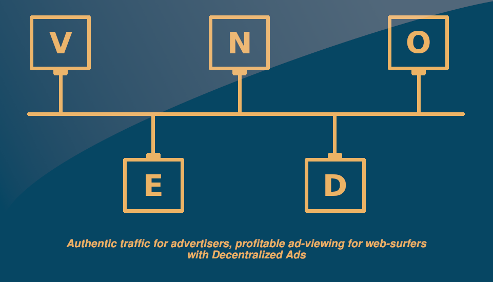

# VENDO :loudspeaker: :closed_lock_with_key: :dollar:


# Decentralized Ads - 


### Tagline - 

> Decentralized Ads - Authentic traffic for advertisers, Profitable ad-viewing for web-surfers


### Integrating Vendo into your Website is as easy as -

```
HTML
<div id="adspace" data-integrator-hash='b05ef7cd0d1c7191fe715209d24ffd54a5c1b3d91b6ef67a1fef62f6d26b18b2'></div>

JS
<script src="ads_heroku.js"></script>
```

### The Problem It Solves

1. **Companies lose revenue on ad platforms due to people using adblock and faking impressions.**
**Solution** - 
Our solution incentivizes viewers to view ads by offering them Vendos (VEN, ERC20) for verifying their impressions.
Impressions are verified by asking viewers to fill out a captcha "related to the company's tagline", thus, making impressions really count.

2. **Privacy Issues in Centralized Ad Systems**
**Solution** - 
WE DON'T USE COOKIES! Personalization is still possible using wallet address but we let viewers opt out if they want.

3. **Validating Impression Count for CPI**
** Solution** -
Centralized Ad pricing works on trust, but decentralization makes this process more ** *transparent* ** and all impressions that are stored on the chain can be verified by the anyone including the publisher and marketer.


